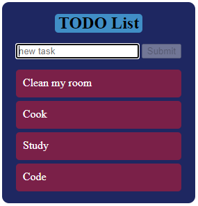

# Internet-Application-Programming-TODO-List
**Name**  : Ezekiel Gikuhi 
**REGNO** : SCT212-0112/2022 

## Overview
I have used Javascript, HTML and CSS to create a to-do list form which takes input from the user and displays it on the screen.

